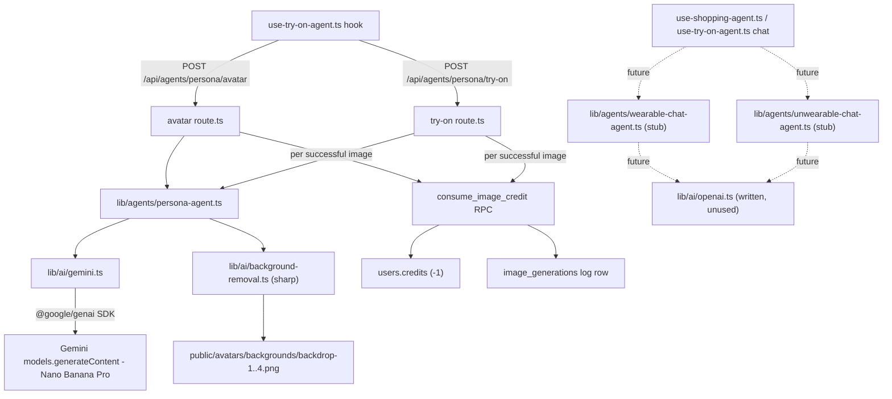

# Persona AI — Architecture & Restructure Plan

## Final Decision Summary

**Stack stays:** Next.js 16 App Router (no separate Express server)  
**Worker strategy:** Add Trigger.dev/Inngest alongside Next.js only when LLM batch jobs exceed 60s  
**Immediate action:** Restructure `src/` into a `modules/` architecture + add `lib/db/` query layer  

---

## Why This Architecture

| Decision | Reason |
|---|---|
| Keep Next.js full-stack | Real-time conversational agents (2–15s) fit perfectly in streaming route handlers |
| No separate Express server | Same codebase, one deployment, no type bridging needed |
| Add worker service later | Only when catalog indexing / batch agent jobs need >60s — use Trigger.dev, not Express |
| Restructure now | 157 files is the ideal size — painful at 400+ files |

---

## Target Folder Structure

```
src/
│
├── app/                              ← Next.js routing ONLY (thin wrappers)
│   ├── (auth)/                       ← Public auth pages
│   │   ├── sign-in/page.tsx
│   │   ├── sign-up/page.tsx
│   │   ├── forgot-password/page.tsx
│   │   ├── onboarding/page.tsx
│   │   └── layout.tsx
│   ├── (dashboard)/                  ← Protected dashboard pages
│   │   ├── layout.tsx
│   │   ├── loading.tsx
│   │   ├── workspaces/
│   │   │   ├── page.tsx
│   │   │   └── [id]/                 ← param name matches api/workspaces/[id]/route.ts
│   │   │       ├── page.tsx
│   │   │       ├── assistant/page.tsx
│   │   │       ├── analytics/page.tsx
│   │   │       ├── branding/page.tsx
│   │   │       ├── try-on/page.tsx
│   │   │       ├── settings/page.tsx
│   │   │       └── embed/page.tsx
│   │   ├── setup/page.tsx
│   │   ├── analytics/page.tsx
│   │   ├── store/page.tsx
│   │   ├── usage/page.tsx
│   │   └── settings/page.tsx
│   ├── (marketing)/
│   │   └── page.tsx
│   ├── api/
│   │   ├── auth/                     ← Auth API routes (delegates to modules/auth)
│   │   │   ├── login/route.ts
│   │   │   ├── register/route.ts
│   │   │   ├── logout/route.ts
│   │   │   ├── verify-email/route.ts
│   │   │   ├── resend-verification/route.ts
│   │   │   ├── forgot-password/route.ts
│   │   │   ├── verify-reset-code/route.ts
│   │   │   ├── reset-password/route.ts
│   │   │   ├── user/route.ts
│   │   │   └── google/
│   │   │       ├── route.ts
│   │   │       └── callback/route.ts
│   │   ├── account/                  ← Account API routes
│   │   │   ├── route.ts
│   │   │   ├── profile/route.ts
│   │   │   ├── change-password/route.ts
│   │   │   ├── set-password/route.ts
│   │   │   ├── sessions/route.ts
│   │   │   └── notifications/route.ts
│   │   ├── workspaces/               ← Workspace CRUD
│   │   │   ├── route.ts
│   │   │   └── [id]/route.ts
│   │   ├── agents/                   ← LLM agent endpoints
│   │   │   ├── shopping/route.ts     ← PLANNED — streaming chat response (unwearable mode, not built yet)
│   │   │   ├── wearable/route.ts     ← PLANNED — streaming chat response (wearable mode, not built yet)
│   │   │   └── persona/              ← REAL — Persona Agent image generation (see lib/agents/persona-agent.ts)
│   │   │       ├── avatar/route.ts   ← POST — photo + measurements → 4 avatar variations
│   │   │       └── try-on/route.ts   ← POST — avatar + garment image(s) → try-on render
│   │   └── onboarding/
│   │       └── complete/route.ts
│   ├── layout.tsx
│   └── page.tsx
│
├── modules/                          ← ONE folder per domain, self-contained
│   │
│   ├── auth/                         ← Everything authentication
│   │   ├── components/               ← SignInForm, SignUpForm, etc.
│   │   │   ├── sign-in-form.tsx
│   │   │   └── sign-up-form.tsx
│   │   ├── context/
│   │   │   └── user-context.tsx      ← was: src/lib/auth/user-context.tsx
│   │   └── lib/
│   │       ├── session.ts            ← was: src/lib/auth/session.ts
│   │       ├── get-user.ts           ← was: src/lib/auth/get-user.ts
│   │       ├── helpers.ts            ← was: src/lib/auth/helpers.ts
│   │       └── google.ts             ← was: src/lib/auth/google.ts
│   │
│   ├── workspaces/                   ← Everything workspaces (project shell only: name, mode, status —
│   │   │                                no store connection or category data; that's account-level, see modules/store/)
│   │   ├── components/
│   │   │   ├── workspace-list.tsx    ← was: features/workspaces/components/
│   │   │   ├── workspace-card.tsx    ← reads connection/categories from modules/store/store.ts, not the workspace
│   │   │   └── workspace-overview.tsx
│   │   ├── settings/                 ← was: features/workspace-settings/
│   │   │   ├── workspace-settings-dashboard.tsx  ← 2 tabs only: General, Danger Zone
│   │   │   ├── ws-general-section.tsx
│   │   │   ├── ws-branding-editor.tsx
│   │   │   └── ws-danger-section.tsx
│   │   │       (ws-categories-section.tsx removed — category selection now
│   │   │        lives in store/components/catalog-sync-panel.tsx, since
│   │   │        choosing active categories is part of the store/catalog
│   │   │        setup flow, not project settings)
│   │   ├── hooks/
│   │   │   └── use-workspaces.ts     ← was: features/workspaces/hooks/
│   │   ├── providers/
│   │   │   └── workspaces-bootstrap.tsx  ← was: components/providers/
│   │   ├── store.ts                  ← was: lib/store/workspace-store.ts (no globalConnection — moved to modules/store/store.ts)
│   │   ├── types.ts                  ← was: domain/workspaces/types.ts (no storeConnection/selectedCategoryIds fields)
│   │   └── constants.ts              ← was: domain/workspaces/constants.ts
│   │
│   ├── onboarding/                   ← Setup wizard (Name → Mode → Review; no Categories step —
│   │   │                                category selection happens later in Store → Catalog Sync)
│   │   ├── components/
│   │   │   ├── setup-wizard.tsx
│   │   │   ├── step-name.tsx
│   │   │   ├── step-mode.tsx
│   │   │   └── step-review.tsx
│   │   ├── hooks/
│   │   │   └── use-setup-wizard.ts
│   │   └── schemas/
│   │       └── workspace-setup.ts
│   │
│   ├── settings/                     ← Account settings
│   │   ├── components/
│   │   │   ├── settings-dashboard.tsx
│   │   │   ├── general-settings.tsx      ← the "Profile" nav item; stacks 3 cards: ProfileForm, <PasswordSettings />, <ConnectedAccounts />
│   │   │   ├── password-settings.tsx     ← not its own nav item — rendered inside general-settings.tsx
│   │   │   ├── connected-accounts.tsx    ← not its own nav item — rendered inside general-settings.tsx
│   │   │   ├── notifications-settings.tsx
│   │   │   ├── billing-settings.tsx
│   │   │   └── danger-zone.tsx
│   │   ├── context/
│   │   │   └── settings-profile-context.tsx
│   │   └── mocks/
│   │       └── defaults.ts           ← BRAND_COLOR_PRESETS (used by ws-branding-editor)
│   │       (no hooks/use-settings.ts — superseded by settings-dashboard.tsx +
│   │        settings-profile-context.tsx, which the real account settings UI uses)
│   │
│   ├── analytics/                    ← Analytics dashboard
│   │   ├── components/
│   │   │   ├── analytics-dashboard.tsx
│   │   │   ├── kpi-row.tsx
│   │   │   ├── sales-chart.tsx
│   │   │   ├── conversion-funnel.tsx
│   │   │   ├── workspace-breakdown.tsx
│   │   │   ├── shopper-stats.tsx
│   │   │   ├── top-products-table.tsx
│   │   │   ├── assistant-insights.tsx
│   │   │   └── try-on-insights.tsx
│   │   └── mocks/
│   │       └── analytics-data.ts
│   │
│   ├── store/                        ← E-commerce store connection — account-level (one per owner,
│   │   │                                survives project delete/recreate), backed by the
│   │   │                                `store_connections` table (see lib/db/store-connections.ts).
│   │   │                                Shopify is a real integration (Admin API, see lib/shopify/client.ts) —
│   │   │                                merchant brings their own Shopify app's Client ID/Secret, exchanged
│   │   │                                for a token via the OAuth client credentials grant (no redirect flow).
│   │   │                                WordPress is also a real integration (WooCommerce REST API, see
│   │   │                                lib/woocommerce/client.ts) — merchant authenticates with a WordPress
│   │   │                                Application Password (Basic Auth, no expiry). The separate
│   │   │                                "WooCommerce" platform button was removed — "WordPress" is the one
│   │   │                                entry point for e-commerce-on-WordPress. Custom remains simulated.
│   │   ├── components/
│   │   │   ├── store-dashboard.tsx   ← Connection tab has no "Replace with a different store" —
│   │   │   │                            disconnect first, then the connect form reappears
│   │   │   ├── connection-card.tsx
│   │   │   ├── connect-store-form.tsx
│   │   │   └── catalog-sync-panel.tsx  ← also owns category selection (selectedCategoryIds),
│   │   │                                  persisted via PATCH /api/store-connection, merged in
│   │   │                                  from the former ws-categories-section.tsx
│   │   ├── hooks/
│   │   │   └── use-store-connect.ts  ← thin bridge from the Store page to store.ts; only reads
│   │   │                                workspace.mode (from modules/workspaces/store.ts) to pick
│   │   │                                the wearable/unwearable mock category taxonomy
│   │   ├── providers/
│   │   │   └── store-connection-bootstrap.tsx  ← mounted in (dashboard)/layout.tsx, loads store.ts on mount
│   │   ├── store.ts                  ← Zustand — connection, selectedCategoryIds, productCount, syncedAt;
│   │   │                                single source of truth, calls /api/store-connection
│   │   ├── mocks/
│   │   │   └── connections.ts
│   │   ├── types.ts                  ← was: domain/store/types.ts
│   │   └── constants.ts              ← was: domain/store/constants.ts
│   │
│   ├── billing/                      ← Plans, credits & usage (frontend-only, no payment provider yet)
│   │   │                                Settings > Billing is project-gated: with no project yet it
│   │   │                                renders an EmptyState ("Create Project") instead of any plan/
│   │   │                                credit UI. Once a project exists, tiers are mode-aware via
│   │   │                                getPlanTiers(mode) — Wearable keeps Nano Banana render pricing
│   │   │                                (Fixed $2,000, Hybrid $500+10%), Unwearable is tool-usage only,
│   │   │                                no render costs (Fixed $1,500, Hybrid $0+10%), and has no
│   │   │                                Credit Bundles section at all (no image API calls to overage).
│   │   │                                The Hybrid Performance Tier is isContactOnly in both modes —
│   │   │                                commission/profit-based, so it needs a manually-negotiated
│   │   │                                contract rather than a self-service "switch to this plan".
│   │   ├── components/
│   │   │   ├── usage-dashboard.tsx   ← /usage page: images created, remaining credit only (still
│   │   │   │                            wearable-flavored; not mode-gated, out of scope for now)
│   │   │   ├── usage-summary-cards.tsx
│   │   │   ├── usage-chart.tsx
│   │   │   ├── plans-section.tsx     ← rendered from Settings > Billing, not /usage; takes a
│   │   │   │                            `mode` prop, renders getPlanTiers(mode)/getInfraNotes(mode)
│   │   │   ├── plan-card.tsx         ← renders plan.description; disables + relabels the button to
│   │   │   │                            "Contact Us to Enable" when plan.isContactOnly
│   │   │   ├── credit-bundles-section.tsx  ← rendered from Settings > Billing (Wearable only), not /usage
│   │   │   ├── credit-bundle-card.tsx
│   │   │   ├── api-key-section.tsx   ← BYO OpenAI key for the chat agent (Settings > API Keys) — real DB persistence
│   │   │   └── chat-usage-section.tsx  ← /usage page: BYO-chat lane, separate from Autommerce-metered image credits
│   │   ├── hooks/
│   │   │   ├── use-billing.ts        ← accepts an optional mode (defaults to "wearable" for /usage);
│   │   │   │                            resolves tiers via getPlanTiers(mode), returns them as `tiers`
│   │   │   └── use-openai-api-key.ts ← real CRUD against /api/account/api-key (GET/PUT/DELETE); never receives the raw key back, only hasKey + a masked preview
│   │   ├── mocks/
│   │   │   ├── usage-history.ts
│   │   │   └── chat-usage.ts         ← informational-only mock (Autommerce doesn't meter chat)
│   │   ├── store.ts                  ← Zustand — activeTierId, rendersUsed, overageCredits (still frontend-only; the OpenAI key moved off this store into use-openai-api-key.ts once it became DB-backed)
│   │   ├── types.ts
│   │   └── constants.ts              ← PLAN_TIERS + UNWEARABLE_PLAN_TIERS (Fixed / Hybrid, mode-specific
│   │                                    pricing/features), getPlanTiers(mode) selector, INFRA_NOTES +
│   │                                    UNWEARABLE_INFRA_NOTES / getInfraNotes(mode), CREDIT_BUNDLES,
│   │                                    MONTHLY_INCLUDED_RENDERS
│   │
│   ├── shopping-agent/               ← Text shopping assistant (unwearable mode)
│   │   ├── components/
│   │   │   ├── chat-interface.tsx
│   │   │   ├── chat-message.tsx
│   │   │   └── product-recommendation-card.tsx
│   │   ├── hooks/
│   │   │   └── use-shopping-agent.ts
│   │   ├── mocks/
│   │   │   └── responses.ts
│   │   └── types.ts                  ← was: domain/agents/types.ts (shared parts)
│   │
│   └── wearable-agent/               ← Visual try-on agent (wearable mode)
│       ├── components/
│       │   ├── try-on-layout.tsx
│       │   ├── try-on-agent-chat.tsx
│       │   ├── try-on-preview-panel.tsx
│       │   ├── profile-setup-gate.tsx
│       │   ├── body-profile-form.tsx
│       │   ├── avatar-generation-loading.tsx
│       │   ├── avatar-variation-picker.tsx
│       │   ├── avatar-mannequin-panel.tsx  ← composites the real subject-only cutout over its
│       │   │                                  paired fixed backdrop plate (profile.backdropUrl)
│       │   ├── edit-model-stats-modal.tsx
│       │   └── wearable-chat-message.tsx
│       │   (no outfit-builder-panel.tsx / preview-panel.tsx / product-selector.tsx /
│       │    wearable-product-card.tsx — an earlier non-chat try-on UI, fully
│       │    superseded by the try-on-agent-chat conversational flow above)
│       ├── hooks/
│       │   └── use-try-on-agent.ts   ← use-try-on.ts removed (superseded, see above). Avatar
│       │                                generation and try-on rendering call the real Persona
│       │                                Agent (POST /api/agents/persona/avatar and /try-on) —
│       │                                MOCK_AVATAR_VARIATIONS / MOCK_TRY_ON_IMAGES only remain
│       │                                as placeholder initial state, no longer used for results.
│       ├── mocks/
│       │   ├── products.ts
│       │   └── responses.ts
│       └── types.ts                  ← was: domain/agents/types.ts (wearable parts)
│
├── components/                       ← Truly shared UI — no business logic
│   ├── ui/                           ← Primitives (Button, Card, Input, etc.) — UNCHANGED
│   └── layout/                       ← Shell, sidebar, header — UNCHANGED
│       ├── dashboard-shell.tsx
│       ├── dashboard-header-context.tsx
│       ├── app-sidebar.tsx
│       ├── panel-nav.tsx
│       ├── workspace-switcher.tsx
│       └── sidebar/
│           ├── sidebar-nav-item.tsx
│           ├── sidebar-workspace-card.tsx
│           └── sidebar-preview-cta.tsx
│
├── lib/                              ← Pure infrastructure — zero business logic
│   ├── supabase/                     ← DB client only
│   │   └── server.ts                 ← no client.ts — no client-side Supabase calls
│   │                                    exist (auth is custom cookie sessions, all
│   │                                    DB access is server-side). Add back if/when
│   │                                    client-side Storage uploads or realtime are needed.
│   ├── db/                           ← NEW — reusable DB query functions
│   │   ├── workspaces.ts             ← getWorkspacesByOwner, createWorkspace, etc.
│   │   ├── users.ts                  ← getUserById, updateUser, etc.
│   │   ├── sessions.ts               ← createSession, deleteSession, etc.
│   │   ├── notifications.ts          ← getNotificationPrefs, upsertPrefs
│   │   └── image-generations.ts      ← consumeImageCredit (RPC), getImageGenerationCount
│   ├── ai/                           ← NEW — central AI-calling layer, no business logic
│   │   ├── gemini.ts                 ← REAL — Nano Banana Pro (Gemini 3 Pro Image) Interactions
│   │   │                                API client via @google/genai. generateGeminiImage(),
│   │   │                                fetchImageAsBase64(). Model from GEMINI_IMAGE_MODEL env;
│   │   │                                image size hardcoded to "2K" (fixed product decision).
│   │   ├── background-removal.ts     ← REAL — sharp-based chroma-key stripBackgroundToTransparent().
│   │   │                                Thresholds pixels near the fixed #FF00FF magenta constant
│   │   │                                to transparent, re-encodes as PNG.
│   │   └── openai.ts                 ← REAL, unused for now — Chat Completions client
│   │                                    (generateChatCompletion), takes the caller's BYO key as a
│   │                                    param. Written for the future chat agents below; not
│   │                                    called by any UI yet.
│   ├── agents/                       ← NEW — one file per agent (prompt-building + orchestration)
│   │   ├── persona-agent.ts          ← REAL, wired end-to-end — image creation agent.
│   │   │                                generateAvatarVariations() runs 4 parallel Gemini calls
│   │   │                                (distinct outfit style per variation), each stripped to a
│   │   │                                transparent cutout and paired 1:1 with a fixed backdrop
│   │   │                                plate (public/avatars/backgrounds/backdrop-{1..4}.png).
│   │   │                                generateTryOnImage() dresses the avatar in the given
│   │   │                                garment reference image(s). PersonaAgentError wraps
│   │   │                                Gemini failures with a user-facing message.
│   │   ├── wearable-chat-agent.ts    ← STUB — chat agent for wearable mode (delegates to the
│   │   │                                existing mock response generator; future real-OpenAI
│   │   │                                wiring point via lib/ai/openai.ts + the account's BYO key)
│   │   └── unwearable-chat-agent.ts  ← STUB — chat agent for unwearable mode (same pattern)
│   ├── mock-api/                     ← Temporary mock data (deleted as features go real)
│   │   └── catalog.ts                ← Still needed by categories/store features
│   └── utils/
│       └── cn.ts                     ← UNCHANGED
│
├── styles/
│   └── globals.css                   ← UNCHANGED
│
└── proxy.ts                          ← Route guard — UNCHANGED
```

---

## Complete File Migration Map

Every file — current path → new path:

### `src/lib/auth/` → `src/modules/auth/lib/` and `src/modules/auth/context/`

| Current | New |
|---|---|
| `src/lib/auth/session.ts` | `src/modules/auth/lib/session.ts` |
| `src/lib/auth/get-user.ts` | `src/modules/auth/lib/get-user.ts` |
| `src/lib/auth/helpers.ts` | `src/modules/auth/lib/helpers.ts` |
| `src/lib/auth/google.ts` | `src/modules/auth/lib/google.ts` |
| `src/lib/auth/user-context.tsx` | `src/modules/auth/context/user-context.tsx` |

### `src/lib/store/` → `src/modules/workspaces/`

| Current | New |
|---|---|
| `src/lib/store/workspace-store.ts` | `src/modules/workspaces/store.ts` |

### `src/features/workspaces/` → `src/modules/workspaces/`

| Current | New |
|---|---|
| `src/features/workspaces/components/workspace-list.tsx` | `src/modules/workspaces/components/workspace-list.tsx` |
| `src/features/workspaces/components/workspace-card.tsx` | `src/modules/workspaces/components/workspace-card.tsx` |
| `src/features/workspaces/components/workspace-overview.tsx` | `src/modules/workspaces/components/workspace-overview.tsx` |
| `src/features/workspaces/hooks/use-workspaces.ts` | `src/modules/workspaces/hooks/use-workspaces.ts` |
| `src/features/workspaces/index.ts` | deleted — direct imports replace barrel exports |

### `src/features/workspace-settings/` → `src/modules/workspaces/settings/`

| Current | New |
|---|---|
| `src/features/workspace-settings/components/workspace-settings-dashboard.tsx` | `src/modules/workspaces/settings/workspace-settings-dashboard.tsx` |
| `src/features/workspace-settings/components/ws-general-section.tsx` | `src/modules/workspaces/settings/ws-general-section.tsx` |
| `src/features/workspace-settings/components/ws-branding-editor.tsx` | `src/modules/workspaces/settings/ws-branding-editor.tsx` |
| `src/features/workspace-settings/components/ws-categories-section.tsx` | `src/modules/workspaces/settings/ws-categories-section.tsx` |
| `src/features/workspace-settings/components/ws-danger-section.tsx` | `src/modules/workspaces/settings/ws-danger-section.tsx` |
| `src/features/workspace-settings/index.ts` | deleted |

### `src/components/providers/` → `src/modules/workspaces/providers/`

| Current | New |
|---|---|
| `src/components/providers/workspaces-bootstrap.tsx` | `src/modules/workspaces/providers/workspaces-bootstrap.tsx` |

### `src/features/onboarding/` → `src/modules/onboarding/`

| Current | New |
|---|---|
| `src/features/onboarding/components/setup-wizard.tsx` | `src/modules/onboarding/components/setup-wizard.tsx` |
| `src/features/onboarding/components/step-name.tsx` | `src/modules/onboarding/components/step-name.tsx` |
| `src/features/onboarding/components/step-mode.tsx` | `src/modules/onboarding/components/step-mode.tsx` |
| `src/features/onboarding/components/step-categories.tsx` | `src/modules/onboarding/components/step-categories.tsx` |
| `src/features/onboarding/components/step-review.tsx` | `src/modules/onboarding/components/step-review.tsx` |
| `src/features/onboarding/hooks/use-setup-wizard.ts` | `src/modules/onboarding/hooks/use-setup-wizard.ts` |
| `src/features/onboarding/schemas/workspace-setup.ts` | `src/modules/onboarding/schemas/workspace-setup.ts` |
| `src/features/onboarding/index.ts` | deleted |

### `src/features/settings/` → `src/modules/settings/`

| Current | New |
|---|---|
| `src/features/settings/components/settings-dashboard.tsx` | `src/modules/settings/components/settings-dashboard.tsx` |
| `src/features/settings/components/general-settings.tsx` | `src/modules/settings/components/general-settings.tsx` |
| `src/features/settings/components/password-settings.tsx` | `src/modules/settings/components/password-settings.tsx` |
| `src/features/settings/components/security-settings.tsx` | `src/modules/settings/components/security-settings.tsx` |
| `src/features/settings/components/connected-accounts.tsx` | `src/modules/settings/components/connected-accounts.tsx` |
| `src/features/settings/components/notifications-settings.tsx` | `src/modules/settings/components/notifications-settings.tsx` |
| `src/features/settings/components/billing-settings.tsx` | `src/modules/settings/components/billing-settings.tsx` |
| `src/features/settings/components/danger-zone.tsx` | `src/modules/settings/components/danger-zone.tsx` |
| `src/features/settings/context/settings-profile-context.tsx` | `src/modules/settings/context/settings-profile-context.tsx` |
| `src/features/settings/hooks/use-settings.ts` | `src/modules/settings/hooks/use-settings.ts` |
| `src/features/settings/mocks/defaults.ts` | `src/modules/settings/mocks/defaults.ts` |
| `src/features/settings/index.ts` | deleted |

### `src/features/analytics/` → `src/modules/analytics/`

| Current | New |
|---|---|
| `src/features/analytics/components/analytics-dashboard.tsx` | `src/modules/analytics/components/analytics-dashboard.tsx` |
| `src/features/analytics/components/kpi-row.tsx` | `src/modules/analytics/components/kpi-row.tsx` |
| `src/features/analytics/components/sales-chart.tsx` | `src/modules/analytics/components/sales-chart.tsx` |
| `src/features/analytics/components/conversion-funnel.tsx` | `src/modules/analytics/components/conversion-funnel.tsx` |
| `src/features/analytics/components/workspace-breakdown.tsx` | `src/modules/analytics/components/workspace-breakdown.tsx` |
| `src/features/analytics/components/shopper-stats.tsx` | `src/modules/analytics/components/shopper-stats.tsx` |
| `src/features/analytics/components/top-products-table.tsx` | `src/modules/analytics/components/top-products-table.tsx` |
| `src/features/analytics/components/assistant-insights.tsx` | `src/modules/analytics/components/assistant-insights.tsx` |
| `src/features/analytics/components/try-on-insights.tsx` | `src/modules/analytics/components/try-on-insights.tsx` |
| `src/features/analytics/mocks/analytics-data.ts` | `src/modules/analytics/mocks/analytics-data.ts` |
| `src/features/analytics/index.ts` | deleted |

### `src/features/store-connect/` → `src/modules/store/`

| Current | New |
|---|---|
| `src/features/store-connect/components/store-dashboard.tsx` | `src/modules/store/components/store-dashboard.tsx` |
| `src/features/store-connect/components/connection-card.tsx` | `src/modules/store/components/connection-card.tsx` |
| `src/features/store-connect/components/connect-store-form.tsx` | `src/modules/store/components/connect-store-form.tsx` |
| `src/features/store-connect/components/catalog-sync-panel.tsx` | `src/modules/store/components/catalog-sync-panel.tsx` |
| `src/features/store-connect/hooks/use-store-connect.ts` | `src/modules/store/hooks/use-store-connect.ts` |
| `src/features/store-connect/mocks/connections.ts` | `src/modules/store/mocks/connections.ts` |
| `src/features/store-connect/index.ts` | deleted |

### `src/features/shopping-agent/` → `src/modules/shopping-agent/`

| Current | New |
|---|---|
| `src/features/shopping-agent/components/chat-interface.tsx` | `src/modules/shopping-agent/components/chat-interface.tsx` |
| `src/features/shopping-agent/components/chat-message.tsx` | `src/modules/shopping-agent/components/chat-message.tsx` |
| `src/features/shopping-agent/components/product-recommendation-card.tsx` | `src/modules/shopping-agent/components/product-recommendation-card.tsx` |
| `src/features/shopping-agent/hooks/use-shopping-agent.ts` | `src/modules/shopping-agent/hooks/use-shopping-agent.ts` |
| `src/features/shopping-agent/mocks/responses.ts` | `src/modules/shopping-agent/mocks/responses.ts` |
| `src/features/shopping-agent/index.ts` | deleted |

### `src/features/wearable-agent/` → `src/modules/wearable-agent/`

| Current | New |
|---|---|
| `src/features/wearable-agent/components/*.tsx` (all 11 files) | `src/modules/wearable-agent/components/` |
| `src/features/wearable-agent/hooks/use-try-on.ts` | `src/modules/wearable-agent/hooks/use-try-on.ts` |
| `src/features/wearable-agent/hooks/use-try-on-agent.ts` | `src/modules/wearable-agent/hooks/use-try-on-agent.ts` |
| `src/features/wearable-agent/mocks/products.ts` | `src/modules/wearable-agent/mocks/products.ts` |
| `src/features/wearable-agent/mocks/responses.ts` | `src/modules/wearable-agent/mocks/responses.ts` |
| `src/features/wearable-agent/index.ts` | deleted |

### `src/domain/` → absorbed into modules

| Current | New |
|---|---|
| `src/domain/workspaces/types.ts` | `src/modules/workspaces/types.ts` |
| `src/domain/workspaces/constants.ts` | `src/modules/workspaces/constants.ts` |
| `src/domain/store/types.ts` | `src/modules/store/types.ts` |
| `src/domain/store/constants.ts` | `src/modules/store/constants.ts` |
| `src/domain/products/types.ts` | `src/modules/shopping-agent/types.ts` (shared via import) |
| `src/domain/products/constants.ts` | `src/modules/shopping-agent/constants.ts` |
| `src/domain/agents/types.ts` | split: wearable types → `modules/wearable-agent/types.ts`, shared chat types → `modules/shopping-agent/types.ts` |
| `src/domain/agents/constants.ts` | `src/modules/shopping-agent/constants.ts` |

---

## New Files to Create: `src/lib/db/`

These extract raw Supabase queries out of API routes into reusable functions:

### `src/lib/db/workspaces.ts`
```typescript
export async function getWorkspacesByOwner(ownerId: string)
export async function getWorkspaceById(id: string, ownerId: string)
export async function createWorkspace(data: CreateWorkspaceInput)
export async function updateWorkspace(id: string, ownerId: string, patch: UpdateWorkspaceInput)
export async function deleteWorkspace(id: string, ownerId: string)
export async function countWorkspacesByOwner(ownerId: string)
```
`workspaces` only stores `name`, `mode`, `status` — no store connection or category columns.

### `src/lib/db/store-connections.ts`
```typescript
export async function getStoreConnectionByOwner(ownerId: string)
export async function upsertStoreConnection(data: UpsertStoreConnectionInput)   // connect / replace
export async function updateStoreConnection(ownerId: string, patch: UpdateStoreConnectionInput)  // categories, sync fields
export async function deleteStoreConnection(ownerId: string)                    // disconnect
```
Backs the `store_connections` table (one row per `owner_id`, unique — account-level, not tied to a
project): `platform`, `store_name`, `store_url`, `api_key_encrypted`, `status`, `selected_category_ids`
(jsonb), `categories` (jsonb — the store's full available taxonomy), `product_count`, `synced_at`.
Exposed via `src/app/api/store-connection/route.ts` (GET/POST/PATCH/DELETE); the API route never
returns `api_key_encrypted` to the client.

`api_key_encrypted` is a **generalized encrypted credentials column**, not a single bare secret: it
holds `encryptSecret(JSON.stringify(fields))` where `fields` varies by `platform` — `{ clientId,
clientSecret }` for Shopify, `{ wpUsername, wpAppPassword }` for WordPress, `{ apiKey }` for the
still-simulated Custom platform. `encodeCredentials`/`decodeCredentials` in `src/lib/utils/crypto.ts`
wrap this so any future platform's multi-field credentials fit without a schema change.

### `src/lib/shopify/client.ts`
```typescript
export function normalizeShopifyDomain(input: string): string        // "mystore" → "mystore.myshopify.com"
export async function getShopifyAccessToken(domain: string, clientId: string, clientSecret: string)  // OAuth client credentials grant
export async function verifyShopifyCredentials(domain: string, accessToken: string)  // throws ShopifyApiError on invalid creds
export async function getShopifyProductCount(domain: string, accessToken: string)
export async function getShopifyCollections(domain: string, accessToken: string)     // custom + smart collections → StoreCategory[]
```
Real Shopify Admin API (REST). Authentication is a **"bring your own app" client-credentials model**,
not an OAuth redirect flow: each merchant creates their own Custom app in their own Shopify Dev
Dashboard (scoped to their own store, `read_products` scope), installs it on their store, and pastes
its Client ID + Client Secret into the Connect Store form. `getShopifyAccessToken` exchanges those for
a short-lived (~24h) Admin API access token via `POST /admin/oauth/access_token` with
`grant_type=client_credentials` — no browser redirect/approval screen, and no Shopify App Review,
because the client credentials grant only works when the app and the store belong to the same Shopify
organization, which is guaranteed here since the merchant owns both. No access token is stored; only
the encrypted Client ID/Secret are, and a fresh token is requested on every connect/sync. Used by
`/api/store-connection` POST (connect: gets a token, verifies credentials, pulls real product count +
collections) and PATCH with `{ sync: true }` (decodes the stored Client ID/Secret, gets a fresh token,
re-pulls both). The Custom platform option still simulates these numbers (`Math.random`) — no real
integration yet.

### `src/lib/woocommerce/client.ts`
```typescript
export function normalizeWordPressUrl(input: string): string   // "example.com" → "https://example.com"
export async function verifyWordPressCredentials(siteUrl: string, username: string, appPassword: string)  // throws WooCommerceApiError on invalid creds
export async function getWordPressProductCount(siteUrl: string, username: string, appPassword: string)
export async function getWordPressCategories(siteUrl: string, username: string, appPassword: string)      // → StoreCategory[]
```
Real WooCommerce REST API (`/wp-json/wc/v3`) for e-commerce-on-WordPress stores. Authentication is a
**WordPress Application Password** (Basic Auth) rather than OAuth or WooCommerce's own Consumer
Key/Secret — the merchant generates one from a dedicated WordPress user (Users → Profile → Application
Passwords, ideally a Shop Manager role) and pastes the username + password into the Connect Store form.
Every request sends `Authorization: Basic base64(username:appPassword)`; unlike Shopify's client
credentials grant, there's no token exchange or expiry — the same credentials are reused until revoked
in WordPress. Product count comes from the `X-WP-Total` response header on `/products?per_page=1`
(WooCommerce has no dedicated count endpoint); category counts come inline from
`/products/categories` (`{ id, name, count }`), simpler than Shopify's per-collection count requests.
Used by `/api/store-connection` POST (connect: verifies credentials, pulls real product count +
categories) and PATCH with `{ sync: true }` (decodes the stored username/Application Password,
re-pulls both). The separate "WooCommerce" platform button was removed from the UI in favor of
"WordPress" as the single real e-commerce-on-WordPress integration; WordPress core content
(posts/pages) sync is out of scope.

### `src/lib/db/users.ts`
```typescript
export async function getUserById(id: string)
export async function getUserByEmail(email: string)
export async function createUser(data: CreateUserInput)
export async function updateUser(id: string, patch: Partial<UserRow>)
export async function setPasswordHash(userId: string, hash: string)
export async function completeOnboarding(userId: string, data: OnboardingData)
export async function setOpenaiApiKey(id: string, encryptedKey: string | null)   // stores ciphertext only
export async function getOpenaiApiKeyEncrypted(id: string)
```

### `src/lib/utils/crypto.ts`
AES-256-GCM helpers for encrypting BYO secrets (currently just the OpenAI key) before they're written
to Postgres. Key is derived from `OPENAI_KEY_ENCRYPTION_SECRET` (env). Exposes `encryptSecret`,
`decryptSecret`, and `maskSecret` (e.g. `"sk-...ab12"`) — the API route only ever sends the mask back
to the client, never the decrypted key, via `src/app/api/account/api-key/route.ts` (GET/PUT/DELETE).

### `src/lib/db/sessions.ts`
```typescript
export async function createSession(userId: string, userAgent: string, ip: string)
export async function getSessionsByUser(userId: string)
export async function deleteSession(sid: string, userId: string)
export async function deleteAllOtherSessions(currentSid: string, userId: string)
```

### `src/lib/db/notifications.ts`
```typescript
export async function getNotificationPrefs(userId: string)
export async function upsertNotificationPrefs(userId: string, prefs: NotificationPrefs)
```

### `src/lib/db/image-generations.ts`
```typescript
export async function consumeImageCredit(userId: string, kind: "avatar" | "try_on"): Promise<boolean>
export async function getImageGenerationCount(userId: string, sinceIso?: string): Promise<number>
```
`consumeImageCredit` calls the `consume_image_credit` Postgres RPC (below) — a single atomic
"check credits, decrement, log" operation so concurrent requests can never double-spend the last
credit. `getImageGenerationCount` is written for a future real-data usage-chart rewrite; the
`/usage` page's chart stays on its existing mock for now, but `users.credits` itself is real.

**`supabase/migrations/0009_image_generations.sql`** — adds `public.image_generations` (one row per
successful avatar/try-on render: `user_id`, `kind`, `created_at`) and the `consume_image_credit(p_user_id, p_kind)`
RPC function. `users.credits` (from `0001_users_sessions.sql`) keeps its default of `0` — no free
starter allowance; credits are granted manually via the Supabase dashboard until real billing exists.

---

## AI Agents: `src/lib/ai/` + `src/lib/agents/`

Two layers, matching the Shopify/WooCommerce client pattern above:
- **`src/lib/ai/`** — raw provider callers only, no business logic: `gemini.ts` (real, used now) and
  `openai.ts` (real, written now, not called by anything yet).
- **`src/lib/agents/`** — one file per agent, owns prompt-building/orchestration: `persona-agent.ts`
  (real, wired end-to-end into the wearable try-on flow), plus `wearable-chat-agent.ts` and
  `unwearable-chat-agent.ts` (structural stubs that delegate to the existing mock response
  generators — not yet consumed by any UI, ready for real OpenAI wiring in a future task).



### `src/lib/ai/gemini.ts` (real)
`GeminiApiError extends Error`; `type GeminiImagePart = { type: "text"; text: string } | { type: "image"; data: string; mimeType: string }`.
`generateGeminiImage(input: GeminiImagePart[], opts?: { aspectRatio?: string })` calls
`ai.models.generateContent({ model: GEMINI_IMAGE_MODEL env ?? "gemini-3-pro-image-preview", contents, config: { responseModalities: ["TEXT", "IMAGE"], imageConfig: { aspectRatio, imageSize: "2K" } } })`
and extracts the first `inlineData` part from `response.candidates[0].content.parts`.
Deliberately **not** the newer `ai.interactions.create` API — despite being documented and typed as
supporting `response_format.delivery: "inline"` for images, that Beta API rejects it with a 400
("Image delivery mode is not supported") in practice; `models.generateContent` is the same stable
surface every official Nano Banana Pro example actually uses. `IMAGE_SIZE = "2K"` is a hardcoded
constant in this file — a fixed "studio-grade" product decision, not env-tunable (note: Google's
own model has a known issue where `imageSize: "2K"` can be silently ignored when reference images
are attached, i.e. image-to-image calls — not something this app's code controls).
`fetchImageAsBase64(url)` base64-encodes a remote image (e.g. a product photo) for use as a
reference image.

### `src/lib/ai/background-removal.ts` (real)
`CHROMA_KEY_COLOR = { r: 255, g: 0, b: 255 }` (`#FF00FF` pure magenta) — the one fixed color every
avatar/try-on prompt asks Gemini to render the subject against (chosen because it essentially never
occurs in skin tones or clothing, unlike green). `stripBackgroundToTransparent(imageBase64, mimeType)`
uses `sharp` to threshold pixels within a color-distance of that constant to transparent (feathered
between an inner/outer threshold) and re-encodes as PNG — the only format that carries alpha.

### `src/lib/ai/openai.ts` (real, unused for now)
`OpenAiApiError extends Error`; `generateChatCompletion(apiKey, messages, opts?: { model? })` POSTs to
`https://api.openai.com/v1/chat/completions` with `model: opts?.model ?? OPENAI_CHAT_MODEL env ?? "gpt-4o-mini"`.
Takes the caller's already-decrypted BYO API key as a parameter (mirrors the Shopify/WordPress
credential pattern) — never reads a platform-level OpenAI key. Not called by anything yet; the wiring
point for the future real `wearable-chat-agent.ts` / `unwearable-chat-agent.ts`.

### `src/lib/agents/persona-agent.ts` (real, wired end-to-end)
`PersonaAgentError extends Error`. `DEFAULT_AVATAR_VARIATION_COUNT = 4` (hardcoded — matches the
4-card "Choose your avatar" UI and the 4 fixed backdrop plates).

- `generateAvatarVariations(input, count = DEFAULT_AVATAR_VARIATION_COUNT)` runs up to `count`
  parallel `generateGeminiImage` calls via `Promise.allSettled` (one failed call doesn't sink the
  batch), each with a different style-hint (tailored blazer / classic suit / relaxed casual /
  elegant fitted) so the 4 results are genuinely dressed differently. Every prompt is built from one
  strongly-worded template, in priority order: **(1) exact face match** to the reference photo, zero
  beautification; **(2) precise body proportions** from the given height/weight/chest/waist/shoe-size
  measurements, not a generic average body; **(3)** the fixed `#FF00FF` chroma backdrop. Aspect ratio
  `3:4` (matches the backdrop plates below). Each result runs through `stripBackgroundToTransparent`
  and pairs 1:1 with backdrop plate *i* (`backdrop-{i}.png`) by position in the batch. Returns only
  the successful results, each with `imageUrl` as a `data:` URL of the isolated subject plus its
  paired `backdropUrl`.
- `generateTryOnImage({ avatarImageUrl, garmentImageUrls })` resolves the avatar (already a
  subject-only `data:` URL) and each garment reference to base64, calls `generateGeminiImage` with
  the same template plus a **(4) garment fidelity** requirement (exact color/pattern/fabric/silhouette,
  face/body/pose unchanged), strips the background, and returns a subject-only `data:` URL — the
  caller already knows which fixed backdrop this avatar is paired with, so it isn't re-decided here.
- Wraps any `GeminiApiError` into `PersonaAgentError` with a user-facing message.

**One-time backdrop setup** (`scripts/generate-backdrop-plates.mjs`, `npm run generate:backdrops`):
the 4 existing `public/avatars/avatar-studio-*.png` files are full composited photos with the model
already baked into the spiral-staircase scene — there's no clean "empty scene" version. This script
runs each one through a single Gemini image-edit call ("remove the person entirely… naturally
reconstruct the empty studio space… preserve the staircase, reflections, lighting exactly as
elsewhere in the frame") and saves the 4 resulting empty plates to
`public/avatars/backgrounds/backdrop-1.png` … `backdrop-4.png` (same `3:4` aspect ratio as the
avatar/try-on generations, so the cutout and its backdrop line up when composited). One-off, run
once during setup — does not touch `users.credits` or `image_generations`.

### `src/lib/agents/wearable-chat-agent.ts` / `unwearable-chat-agent.ts` (structural stubs)
`getWearableAgentReply(userMessage, context)` / `getUnwearableAgentReply(userMessage, context)`
currently just delegate to the existing `getWearableMockResponse` / `getMockResponse` mock
generators, unchanged. Not imported by any UI hook yet — pure scaffolding for real OpenAI wiring
(via `generateChatCompletion` + the account's BYO key from `getOpenaiApiKeyEncrypted`/`decryptSecret`)
in a future task.

### `src/app/api/agents/persona/avatar/route.ts` and `.../try-on/route.ts` (real)
Both: auth via `getCurrentUser()`; if `user.credits <= 0` → `402` immediately, no Gemini call.
`avatar/route.ts` requests `min(count requested, DEFAULT_AVATAR_VARIATION_COUNT, user.credits)`
variations (so a user with only 2 credits left still gets 2 options instead of a hard block; also
lets `regenerateAvatar` request just 1). For each successfully generated image, calls
`consumeImageCredit` (stops early if it ever returns `false` — a race-condition guard), then patches
`session.profile.credits` and calls `session.save()` — the same pattern
[`src/app/api/account/profile/route.ts`](../src/app/api/account/profile/route.ts) uses, so
`useUser().credits` never shows a stale value. Catches `PersonaAgentError`/`GeminiApiError` → 400/502
with `.message`; else 500.

---

## LLM Agent Streaming Architecture (New API Routes)

When building real agent endpoints, use Next.js streaming route handlers:

```typescript
// src/app/api/agents/shopping/route.ts
export async function POST(req: Request) {
  const { message, workspaceId, history } = await req.json();
  const user = await getCurrentUser();

  const stream = new ReadableStream({
    async start(controller) {
      // Call OpenAI / Anthropic with streaming
      for await (const chunk of llmStream) {
        controller.enqueue(new TextEncoder().encode(chunk));
      }
      controller.close();
    },
  });

  return new Response(stream, {
    headers: { "Content-Type": "text/event-stream" },
  });
}
```

Client side consumes with `fetch` + `ReadableStream` reader — no WebSockets needed for conversational agents.

---

## Future Worker Service (Trigger.dev) — Add When Needed

Only add this when you have a job that exceeds 60 seconds (e.g. indexing a full product catalog):

```
# Install when ready
pnpm add @trigger.dev/sdk @trigger.dev/nextjs
```

```
src/
└── trigger/                          ← Job definitions (same repo, same types)
    ├── catalog-index.ts              ← Index store products into vector DB
    ├── store-sync.ts                 ← Sync products when store connects
    └── batch-description.ts          ← Generate AI descriptions for all products
```

Jobs are triggered from API routes:
```typescript
import { catalogIndex } from "@/trigger/catalog-index";
await catalogIndex.trigger({ storeId, workspaceId });
```

**Do NOT add this until you actually have a job that times out.**

---

## Implementation Order

| Step | Task | Complexity |
|---|---|---|
| 1 | Create `src/lib/db/` query layer (4 files) | Low — extract existing queries |
| 2 | Create `src/modules/` and move all `src/features/` files | Medium — file moves + import updates |
| 3 | Move `src/lib/auth/` into `src/modules/auth/lib/` | Medium — many files import from here |
| 4 | Move `src/lib/store/workspace-store.ts` into `src/modules/workspaces/store.ts` | Low |
| 5 | Move `src/domain/` types into their respective modules | Low |
| 6 | Move `src/components/providers/` into `src/modules/workspaces/providers/` | Low |
| 7 | Update `tsconfig.json` path aliases if needed | Low |
| 8 | Delete `src/features/`, `src/domain/`, `src/lib/auth/`, `src/lib/store/` | Cleanup |
| 9 | Run `pnpm lint && pnpm build` to verify zero errors | Verification |

**Total estimate:** All steps in one session, largest risk is Step 3 (auth imports are used everywhere).

---

## `tsconfig.json` Path Aliases (After Restructure)

The `@/` alias stays pointing to `src/` — no change needed. Only the import paths inside files change:

```typescript
// Before
import { useWorkspaceStore } from "@/lib/store/workspace-store";
import { getCurrentUser } from "@/lib/auth/get-user";
import { WorkspaceList } from "@/features/workspaces";

// After
import { useWorkspaceStore } from "@/modules/workspaces/store";
import { getCurrentUser } from "@/modules/auth/lib/get-user";
import { WorkspaceList } from "@/modules/workspaces/components/workspace-list";
```
